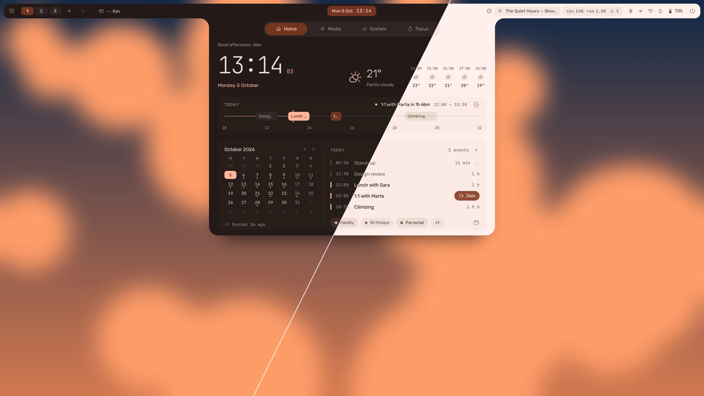
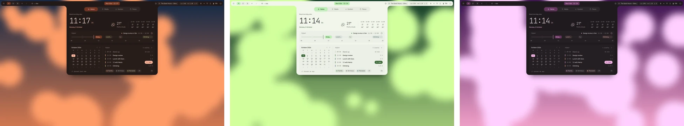

# vela

A Hyprland desktop shell and dotfiles for Fedora, built on
[Quickshell](https://quickshell.org). Material 3 throughout, retinted from the
current wallpaper.



**Documentation: [vela.ijasmin.it](https://vela.ijasmin.it/)**

Targets **Hyprland 0.56** (Lua config manager), **Quickshell 0.3.1** and
**matugen 4**.

## What you get

- **Colours from your wallpaper.** The shell, Hyprland, kitty, GTK apps and the
  lock screen all take its palette: light, dark, or dark after sunset, and a
  little warmer in the evening.
- **A bar with drawers.** The dashboard, the status popouts, the launcher and
  the power menu grow out of it, on whichever edge you put it.
- **A dashboard** with your day and a fold-out month, the music, live system
  rings, pending updates and a focus timer.
- **Your calendars** -- Google, Outlook, iCloud, Nextcloud or any CalDAV server
  -- with reminders, and changes made offline that sync when you are back.
- **Notifications** you can open out and swipe away, with a history and do not
  disturb.
- **A launcher** that also does sums, unit conversion, emoji and the
  clipboard.
- **Windows:** a workspace overview you can drag windows across, and an
  alt + tab picker.
- **Sessions** that save your windows and bring them back, at login if you
  like.
- **Capture** -- screenshots, annotation, recordings, GIFs and OCR -- and a
  clipboard history.
- **A lock screen** with idle times for power and battery, a dock, and a
  keybinds cheatsheet and editor.
- **Claude Code and Codex** usage on the dashboard, and a pill on the bar.
- **Settings for all of it** (super + I), applied as you change them.



## Install

On Fedora Workstation 42 or newer, in a terminal:

```sh
curl -fsSL https://vela.ijasmin.it/install.sh | bash
```

Then log out and pick **Hyprland** on the login screen. Anything already at
vela's paths is moved to `~/.local/state/vela/backup-<date>/` first, and
`vela doctor` lists anything missing at the end. Updating is the same line
again.

[What the installer does](https://vela.ijasmin.it/start/install/) ·
[Updating and uninstalling](https://vela.ijasmin.it/start/update/) ·
[Keybinds](https://vela.ijasmin.it/configure/keybinds/) ·
[Troubleshooting](https://vela.ijasmin.it/help/troubleshooting/)

## Working on it

The shell is QML in `packages/quickshell/.config/quickshell/vela`.
[How it is built](https://vela.ijasmin.it/contributing/architecture/) maps the
repo, and `docs/` records how Quickshell and Hyprland actually behave here --
read it before writing QML or config.

## License

GPL-3.0. See [`LICENSE`](LICENSE).

## Credits

vela is written from scratch, with ideas from these two projects. Thank you
to both.

- [caelestia-dots/shell](https://github.com/caelestia-dots/shell)
- [end-4/dots-hyprland](https://github.com/end-4/dots-hyprland)
