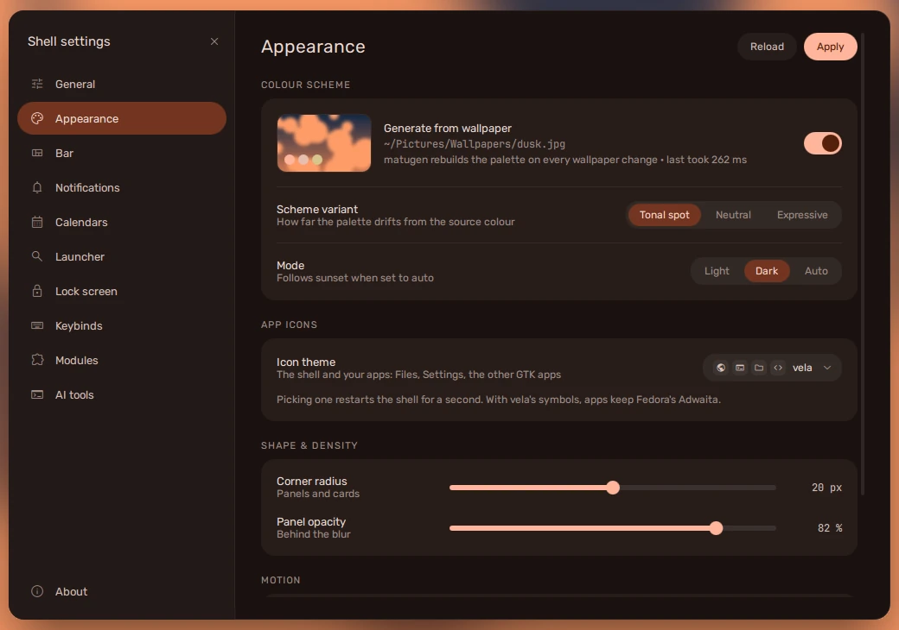

**super + I** opens the settings window. Every change applies at once; there
is nothing to save. (Keybinds are the exception: they wait for **Apply**.)

It is a window like any other, not a modal: the bar, the dock and your other
windows still work while it is open, so an autohiding bar can be tried out
with the window up. Close it with **esc**, the **×** at the top of its menu, or
super + I again. A page's **Reset** asks before it puts anything back.

| Page | Covers |
| --- | --- |
| **General** | where you are (for the weather and sunset), units, evening warmth, your picture, the wallpaper / screenshot / recording folders, restoring your session at login, checking for updates |
| **Appearance** | the palette and its variant, light / dark / auto, app icons (vela's symbols or an icon theme), corner radius, panel opacity, motion (full, reduced or off) and its speed |
| **Bar** | which edge, floating or attached, autohide, the dock and its pinned apps and stacks |
| **Notifications** | do not disturb, where cards go, how long they stay, how many stack, the focus digest |
| **Calendars** | your accounts, each calendar's colour and whether it shows, reminders, how often they sync |
| **Launcher** | what it searches, how many results, the web search engine |
| **Lock screen** | when the screen dims, locks, goes dark and suspends (on a laptop, on power and on battery), what the lock screen shows, the fingerprint reader |
| **Keybinds** | every keybind: change its keys, turn it off, add your own -- see [Keybinds](../keybinds/#changing-one) |
| **Modules** | which items each end of the bar carries, and in what order |
| **AI tools** | connecting Claude Code and Codex, their cards in the System tab, the 90% notification, the pill on the bar -- see [Claude Code and Codex](../../features/ai-tools/) |

## shell.json

The window writes `~/.config/vela/shell.json`, and the shell watches the file:
edit it by hand and the change applies as soon as you save. It is your own
file, copied once from vela's defaults when you install, and no update
touches it; a key vela adds later takes its default until you change it. A
few settings
that rarely change are only in the file. The groups, with the keys worth
knowing:

| Key | Default | |
| --- | --- | --- |
| `appearance.mode` | `"auto"` | `"light"`, `"dark"`, or `"auto"` (dark after sunset) |
| `appearance.scheme` | `"scheme-tonal-spot"` | matugen's variant -- how colourful the palette is |
| `appearance.iconTheme` | `""` | the icon theme apps are drawn with, by its folder name (`"Papirus-Dark"`); empty for vela's symbols. Edited by hand, it applies when the shell next starts, and GTK apps keep their own until you pick it in Settings or run `vela icon-theme` |
| `appearance.eveningWarmth.*` | on, from sunset, 90 min, `strength` 0.35 | the evening warmth; `strength` is how far the shell's colours go toward amber (0–1); `screen: true` warms the screen too (hyprsunset) |
| `bar.position` | `"top"` | `"top"`, `"bottom"`, `"left"`, `"right"` |
| `bar.floating` | `true` | a gap round the bar; `false` attaches it to its edge |
| `bar.autohide.mode` | `"never"` | when the bar hides |
| `bar.workspaces.count` | `5` | workspaces always shown on the bar |
| `bar.modules.left / centre / right` | | the items at each end, in order |
| `dock.enabled`, `dock.behaviour` | `true`, `"autohide"` | the dock, and whether it hides |
| `dock.pinned`, `dock.stacks` | | desktop entries, and folders |
| `notifications.position` | `"top-right"` | where cards appear |
| `notifications.timeout` | `6000` | how long a card stays, in ms |
| `launcher.wallpaperDir` | `"~/Pictures/Wallpapers"` | where the wallpaper switcher looks |
| `launcher.webSearch` | DuckDuckGo | the search URL; the query is added to the end |
| `capture.saveDir`, `capture.recordDir` | `~/Pictures/Screenshots`, `~/Videos/Recordings` | where captures go |
| `capture.defaultAction` | `"copy"` | what Enter does in capture |
| `clipboard.keep` | `200` | how many entries the history keeps |
| `weather.location` | `"auto"` | `"auto"` (from your connection) or a city |
| `weather.units` | `"metric"` | or `"imperial"` |
| `sessions.restoreOnLogin` | `true` | bring the last layout back at login |
| `dashboard.focusTimer.*` | 25 min, 4 sessions | the focus timer, and its two switches |
| `updates.showWhatChanged` | `true` | check for updates at all (**Check for updates** in General) |
| `updates.checkCommand` | `dnf5 check-update --refresh` | how updates are counted |
| `ai.claude`, `ai.codex` | `true`, `true` | a card in the System tab for each, while that tool is there |
| `ai.claudeUsage` | `true` | ask Claude Code for what `/usage` shows (Fable's week, the plan) |
| `ai.logos` | `true` | the tools' own logos on their cards and the bar's pill |
| `ai.notifyNearLimit` | `true` | one notification as a plan window passes 90% |

The file itself carries a comment on most keys.

:::note
The keybinds are not in `shell.json`. The defaults are Hyprland's, in
`~/.config/hypr/conf/binds.lua`, and your changes to them are in
`~/.config/vela/keybinds.json` -- see [Keybinds](../keybinds/#where-they-are-kept).
:::
