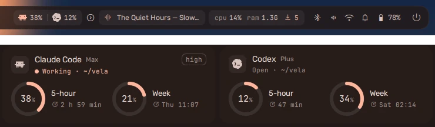

While Claude Code or Codex is open, the dashboard's **System** tab gets a card
for it under the rest. With both open you see both, side by side. With one
open, you see that one across the whole row. Once you close them, the cards
go and the tab looks as it always did.



## What a card shows

- **Your plan** (Max, Business and so on) beside the name.
- **The model and its effort** in the corner: *Fable 5.1 · high*,
  *gpt-5.5-codex · medium*.
- **What the session is doing,** and in which folder: *Working*, **Needs
  you** (it is asking for a permission), *Done*, or *Open*.
- **A ring per plan window,** each with how long until it resets: the 5-hour
  window and the week, and for Claude Code also a model's own weekly limit
  (*Fable week*), the same rows `/usage` shows. A ring turns red at 90%. At
  90% you also get one notification, which you can switch off.

Click a card to go to the terminal that session is running in, or to the
ChatGPT app.

## How fresh the numbers are

The numbers come from the tools themselves and update **every time the tool
gets a reply**. While you work, they are always current.

- **Between replies,** vela counts the resets down itself. When a reset time
  passes, that ring drops to 0% without waiting for the tool.
- **When a tool is closed,** its card goes. vela keeps the last numbers,
  and the card comes back with them the next time you open the tool.
- **Usage somewhere else** -- the Claude or ChatGPT website, another
  computer -- counts if your plan shares its limits. vela sees it at the
  tool's next reply.

## Setting it up

Everything is in **Settings → AI tools**.

**Claude Code.** The rings work without setting anything up: vela asks your
own Claude Code for what `/usage` shows (see below). Press **Connect** as
well for the rest. This adds vela's status line, and a few hooks for the live
status, to `~/.claude/settings.json`. The file is saved first as
`settings.json.vela-backup`. The session and week then move with every reply,
and the card shows the model and its effort. If you already had a status
line, it keeps working: vela runs it after its own, with the same input. With
any status line, Claude Code shows fewer keyboard hints under the prompt;
that is Claude Code, not vela.

**Codex.** The usage needs nothing: vela reads it from Codex's own session
files in `~/.codex/sessions`. For the live status, press **Connect**. This
adds a few hooks to `~/.codex/hooks.json`, backed up the same way. Codex asks
you once to trust new hooks (also under `/hooks` in Codex). On a Business
plan an admin can turn personal hooks off; the usage still shows.

**Codex in the ChatGPT app.** The ChatGPT app for Linux runs Codex itself,
with your `~/.codex`, so Connect Codex covers it too. Codex there shows only
while it is doing something: working, waiting on you, or just done. The app
is open for everything else in it as well, so the app being open does not
count.

**Disconnect** takes out only vela's entries and puts back a status line you
had before. The same from a terminal:

```sh
vela ai connect claude          # or codex
vela ai disconnect claude       # or codex
vela ai claude-usage            # ask Claude Code for /usage now
vela ai status                  # what the shell reads, as JSON
```

### Everything /usage shows

Claude Code's status line carries only the 5-hour window and the week. For
the rest -- a model's own weekly limit like Fable's, and your plan -- vela
asks Claude Code itself, the way `/usage` does. It runs Claude Code for about
a second, headless, with no session saved, no hooks and no MCP servers, and
sends nothing to a model:

- every five minutes while Claude Code is open;
- shortly after a reply;
- when you open the System tab on numbers older than ten minutes.

Claude Code marks this request as experimental, so an update could change
it. If it stops answering, the card keeps the status line's two rings. You can
turn it off with **Everything /usage shows** in Settings → AI tools.

## The pill on the bar

Switch on **Pill in the bar** in Settings → AI tools. It goes before the
arrow that folds the bar's status items away, so folding the bar never hides
a session that is working or waiting on you. You can also add **Claude Code
& Codex** in Settings → Modules and put it anywhere.

It is there while Claude Code or Codex is open: each tool's logo with how
much of its 5-hour window is used, like *8%*.

- **Open:** the logo in a quiet colour.
- **Working:** the logo in your accent colour, gently breathing.
- **Needs you:** the logo and number in a highlighted capsule.
- **Done:** a tick beside the logo for a few seconds, then back to open.

The number turns red at 90%. On a vertical bar the logo sits over the number,
the way CPU and memory do.

Once the tool is closed, the pill is gone. Click it for the dashboard's System
tab, where the cards are, the way CPU and memory open it; click again to close
it. Right-click it to go to the terminal (or the ChatGPT app) of the session
that most wants you.

vela sees that a tool is open from its process, so that part needs nothing.
Codex's background server, which it starts and leaves running after you
quit, does not count as open, and neither does the ChatGPT app.
*Working*, *Needs you* and *Done* come from the tool's hooks, so they need the
tool to be connected. Codex fires no hook until your first prompt: until then
it shows as open.

## The logos

The cards and the pill show Claude Code's and Codex's own logos, drawn in your
palette's colours. They are Anthropic's and OpenAI's marks, so they are not
kept in vela's repository: the installer downloads them from
[theSVG](https://thesvg.org), pinned to one version and checked, into
`~/.local/share/vela/icons/`. If the install was offline, or you install one of
the tools later, the shell fetches the missing logo the first time it sees
the tool. Until then, and with **Their logos** off in Settings → AI tools,
there is a plain badge instead.

```sh
vela ai icons                   # fetch them now (--force to fetch again)
```

## What vela does not do

- **It never reads your login and never contacts a server itself.** It shows
  the numbers these tools already have, and asks Claude Code the way `/usage`
  does; Claude Code does any asking with its own login. No message goes to a
  model, so it uses nothing from your plan.
- **It does not guess.** A window Claude Code or Codex does not report is not
  drawn. One they start reporting shows up as a ring of its own, without an
  update to vela.
- **Codex's session files are Codex's own format.** A Codex update could
  change them. Until vela catches up, the card says the numbers come with
  its next reply.

## Where things are kept

| File | What |
| --- | --- |
| `~/.local/state/vela/ai/claude.json` | Claude Code's last numbers from its status line, with the model and effort |
| `~/.local/state/vela/ai/claude-usage.json` | the last `/usage` answer: every window, and the plan |
| `~/.local/share/vela/icons/` | the two logos, as path data |
| `$XDG_RUNTIME_DIR/vela-ai-live.json` | what each session is doing (gone after a reboot) |
| `shell.json` → `ai` | `claude` and `codex` show or hide a card; `claudeUsage` asks Claude Code for `/usage`; `logos` shows the tools' logos; `notifyNearLimit` is the 90% notification |
