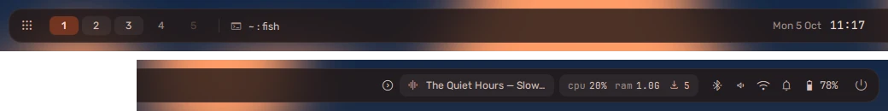
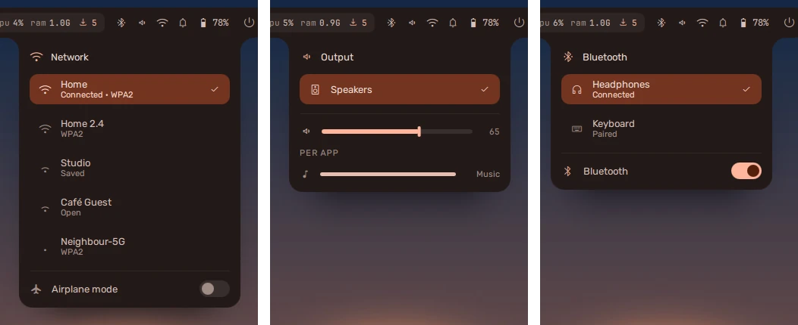

The bar runs along one edge of each monitor. By default it sits at the top,
floating a little clear of the edge.

## What is on it

From one end to the other, as it ships:

| Where | Items |
| --- | --- |
| Start | the launcher button, your workspaces, the focused window's title |
| Centre | the clock -- click it for the [dashboard](../dashboard/) |
| End | media, CPU and memory, the privacy capsule, the tray, battery, power |

**Settings → Modules** chooses which items each end carries, and in what
order. One item is not on the bar until you add it: the
[Claude Code and Codex](../ai-tools/#the-pill-on-the-bar) pill, which goes
before the fold arrow and stays while the bar is folded.

On a laptop the battery warns you with a notification at 20%, again at 10%,
and at 5%. The last two are urgent, which do not disturb lets through unless
you have told it not to. Plugging in takes the warning away.

## Where it goes

**Settings → Bar** puts it on any edge. On the left or right it becomes a
narrow rail and everything re-lays itself out for the tall shape -- the
dashboard slides out sideways rather than dropping down. It can also hide
until you reach the edge (autohide).

Under the edges, **Style** chooses how it sits there: **floating**, a little
clear of the edge with every corner rounded, or **attached**, against the
edge the whole length of it -- square where it meets the edge, rounded only
on the side facing in. The bar moves between the two as you switch.

With more than one monitor, each has its own bar, and the one on the
monitor you are not using dims a little.

## The status popouts

Click an item at the end of the bar for its popout. They grow out of the bar
item itself; opening another while one is open slides across to it.

- **Sound** -- the output device, the master volume, and a slider for each app
  playing.
- **Network** -- the networks in range, strongest first. The first few are
  listed; **N more networks** opens out the rest. Click one to join; a secured
  network you have not used asks for its password right there. Airplane mode
  is at the bottom.
- **Bluetooth** -- your paired devices with their battery where they report it,
  and the devices nearby to pair with. Both lists open out the same way.
- **Power** -- the battery, time left, and the three power profiles.
- **A tray app's menu** -- right-click an app's icon in the tray. The app
  decides what is in its menu; vela draws it like everything else, in your
  palette. A submenu opens in place, with a row at the top to go back.

## Folding it away

The arrow at the start of the status items folds everything up to the clock
away, for a quieter bar: **<** folds it in, **>** brings it back (up and down
on a vertical bar). Two things stay while it is folded, because hiding them
would hide news: the bell while anything is unread, and the privacy capsule
while a microphone, camera or screen share is in use.

## Workspaces

The bar always shows the first five workspaces (`bar.workspaces.count` in
[settings](../../configure/settings/)), and every number up to the highest one in use.
**super + 1..9** goes to one; **super + shift + 1..9** moves the window there.
