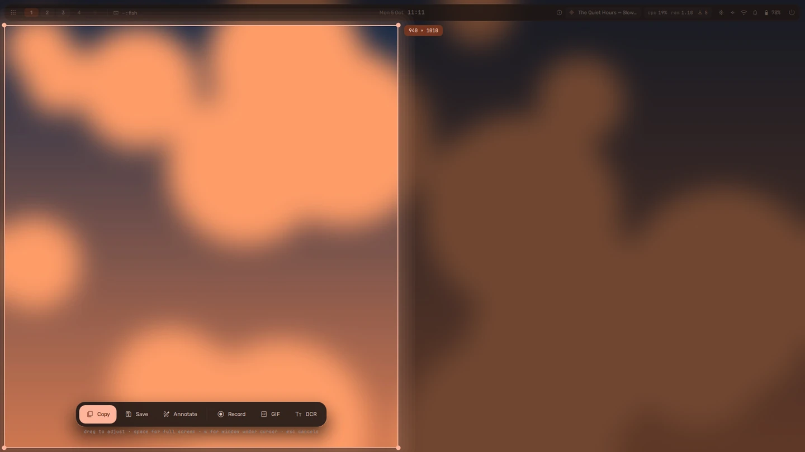
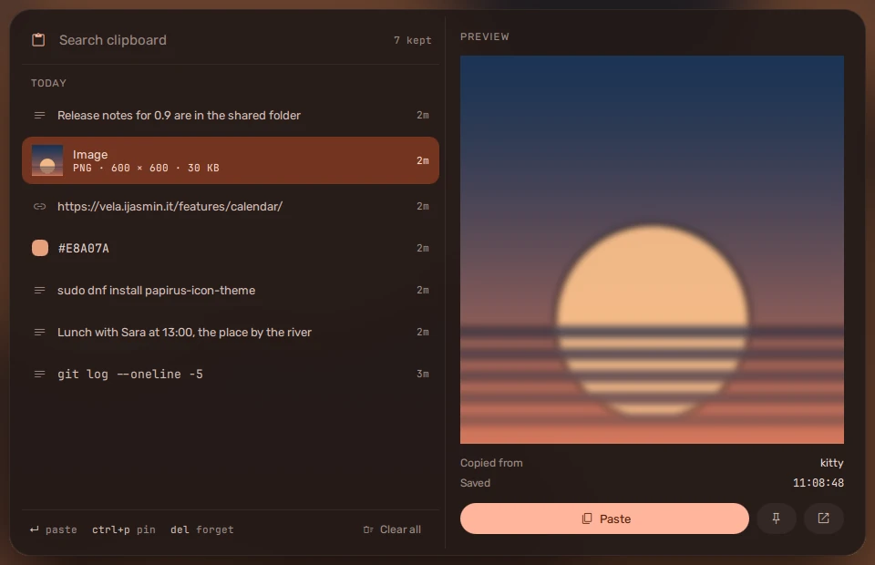

## Capture

**super + shift + S**. Drag out a region first, and choose what to do with it
after:

| Button | Does |
| --- | --- |
| Copy | a screenshot, to the clipboard (Enter does this) |
| Save | a screenshot, to `~/Pictures/Screenshots` |
| Annotate | open it in swappy to draw on |
| Record | a video, to `~/Videos/Recordings` |
| GIF | a short recording as a GIF |
| OCR | the text in the region, to the clipboard |

While choosing: **space** takes the whole screen, **W** the window under the
pointer. While recording, **super + shift + S** again stops. The folders and
what Enter does are in [settings](../../configure/settings/) (`capture`).

## Clipboard history

**super + V**. Everything you copy, newest first: images as thumbnails,
colours as swatches, links as links. Type to filter; **Enter** pastes into the
window you were in. **Pin** an entry to keep it at the top.

| Key or button | Does |
| --- | --- |
| Enter | pastes the entry into the window you were in |
| ctrl + P, or the pin | pins it, or unpins it |
| Del | forgets it |
| the open button | a link in your browser, an image in your image viewer |
| **Clear all**, or ctrl + shift + Del | forgets everything except what is pinned -- press it twice: the first press asks "Clear 12 items?" |

`qs -c vela ipc call clipboard wipe` clears the same way, pinned entries kept.

It is also in the [launcher](../launcher/): type `;` and a word.
