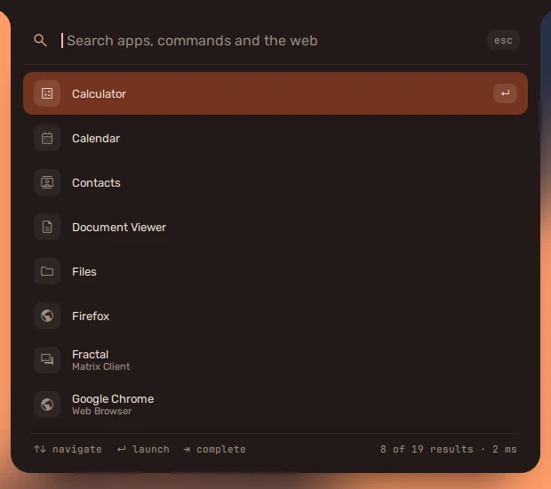

**super + space** opens the launcher on the bar. Type to search your apps;
**Enter** opens the first match, the arrows move through the rest, **Tab**
completes.

It opens in the middle of a top or bottom bar, and a little way down a side
one. It grows with the results as you type, and the search field stays next
to the bar -- on a bottom bar, it is the bottom row.

## More than apps

| Type | Get |
| --- | --- |
| a sum, like `12*7+3` | the answer, first |
| `5 km in mi`, `70 f in c` | the conversion |
| `=` then anything | a calculator, whatever you type |
| `:` then a word | emoji -- Enter types it into the window you were in |
| `;` then a word | your clipboard history |
| anything else | apps, then commands on your `PATH`, then a web search |

**Settings → Launcher** chooses what it searches, how many results it shows,
and which search engine the web search uses.

**super + shift + space** opens fuzzel, a plain launcher that works even if the
shell is not running.
