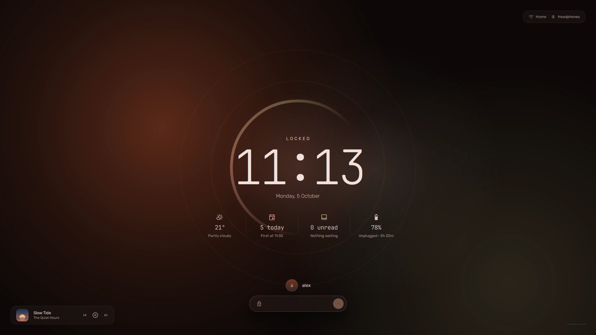

## Locking

**super + L** locks. The lock screen shows the time, the next event, the
weather, unread notifications and the battery, and what is playing with its
controls. A ring round the clock turns with the music. Unlock with your
password, or your finger if the machine has a reader (fprintd).

**Settings → Lock screen** chooses what it shows.

## When you step away

vela dims the screen, locks, turns the screen off and suspends on its own
after the times set in **Settings → Lock screen**.

On a laptop there are **two sets of times**: one for when it is plugged in and
one for on battery, picked with the tabs above the sliders. The page opens on
whichever is in use, so you can give the battery shorter times. A desktop has
one set.

The times are hypridle's, kept in `~/.config/hypr/hypridle.conf`; the page
writes them there and restarts hypridle.

## The power menu

**super + escape**, or the power button at the end of the bar. The menu hangs
off that end of the bar, over a dim that leaves the bar itself lit. Each
action has one key:

| Key | Action |
| --- | --- |
| L | lock |
| S | suspend |
| E | log out |
| R | reboot |
| P | shut down |

Escape, or a click anywhere else, cancels.
