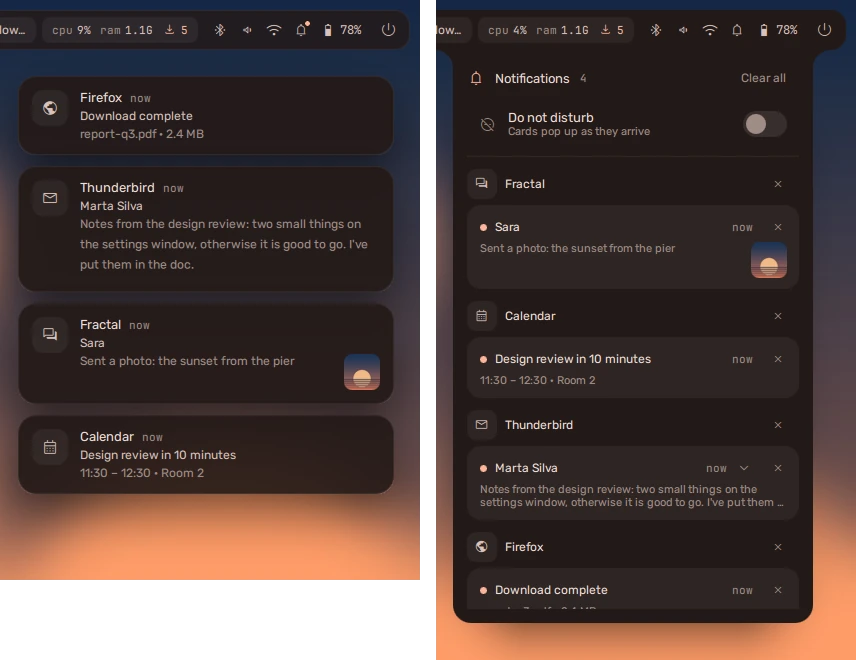

Notifications pop up as cards, stacked one per app. The **bell** at the end of
the tray -- or **super + N** -- opens the history.

## Like a phone

- **Open one out.** A notification that says more than fits has a chevron; it
  opens the card to the whole text, and a screenshot or photo it carries is
  drawn large. Clicking a notification does what its app asked; one that asked
  for nothing opens out instead.
- **Swipe it away.** Drag it sideways, or swipe with two fingers on the
  touchpad; a quick flick is enough, and scrolling up and down still scrolls.
  A swiped card goes into the history; one swiped in the history is gone.
- **Middle-click** dismisses a card outright, as the × does in the history.

## Quiet

| Keys | Does |
| --- | --- |
| **super + ctrl + N** | do not disturb (or right-click the bell) |
| **super + shift + N** | clear the history |

Critical notifications -- a battery about to run out -- always get through.
While a [focus session](../dashboard/#the-focus-timer) holds notifications,
the rest wait for its digest.

**Settings → Notifications** sets where cards appear, how long they stay, and
how many stack.
