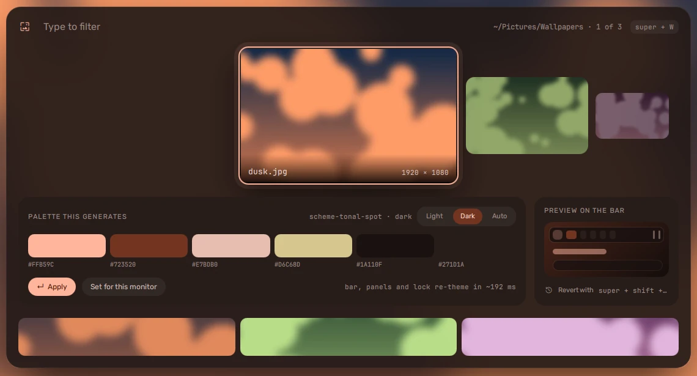

import Compare from '../../../components/Compare.astro';
import themeDark from '../../../assets/screenshots/theme-dark.webp';
import themeLight from '../../../assets/screenshots/theme-light.webp';

Every colour in vela comes from the wallpaper. Pick one, and
[matugen](https://github.com/InioX/matugen) turns it into a Material 3
palette that the shell and your apps all take.


## Choosing a wallpaper

**super + W** opens the switcher: a strip of the images in
`~/Pictures/Wallpapers`, with the palette each would give on the left and a
small bar wearing it on the right.



- **Arrows** move, **Enter** applies.
- **Tab** chooses **light**, **dark** or **auto**; Enter applies it with the
  wallpaper. Auto goes dark at sunset.
- **super + shift + W** goes back to the previous wallpaper.

From a terminal:

```sh
vela wallpaper ~/Pictures/Wallpapers/lake.jpg   # set it, and retheme
vela theme dark                                  # light, dark or toggle
```

## What follows the palette

| App | When |
| --- | --- |
| the shell | at once -- every colour eases across |
| Hyprland (borders) | at once |
| kitty | at once, in every open window |
| cava | at once |
| GTK and libadwaita apps | light or dark at once; their colours on next start |
| fuzzel, hyprlock | next time they open |

Just before the colours change, the shell holds a still frame over every open
window and fades it away once the apps have repainted underneath, so every
window crosses over to the new colours together.

## Look and feel

**Settings → Appearance** sets the palette's variant (how colourful it is),
light / dark / auto, the [app icons](#app-icons), how round the corners are,
how see-through the panels are, and **motion**: full, reduced or off, and how fast -- Hyprland's own window
animations follow the same setting.

The same wallpaper gives a dark palette and a light one. Drag the handle
across to compare them:

<Compare
	before={themeDark}
	after={themeLight}
	beforeLabel="Dark"
	afterLabel="Light"
	alt="The dashboard and bar over the same dusk wallpaper, in the dark palette on one side of the handle and the light palette on the other."
/>

## App icons

The shell draws apps as symbols in the palette's colours: a globe for a
browser, a terminal for kitty, a folder for Files. **Settings → Appearance →
App icons** can use an icon theme instead -- any one installed on the
computer, such as Papirus (`sudo dnf install papirus-icon-theme`), or one you
have put in `~/.local/share/icons`. The list shows a few icons from each.

- The launcher, the dock, alt + tab, the overview, the window title on the bar
  and notifications show each app's own icon from that theme. An app the
  theme has no icon for keeps its symbol.
- Files, Settings and your other GTK apps change to the same theme, and so
  does the fallback launcher (super + shift + space). Going back to vela's
  symbols puts them back on Adwaita, Fedora's own.
- Picking one restarts the shell, which takes a second: Quickshell reads its
  icon theme once, as it starts. Settings opens again where it was.
- The shell's own symbols -- Wi-Fi, battery, the buttons -- stay as they are.
  Only apps change.

Apps that are not GTK apps, such as Qt and KDE ones, and Flatpak apps may keep
their own icons.

From a terminal:

```sh
vela icon-theme                # the installed themes, the one in use marked
vela icon-theme Papirus-Dark   # use one
vela icon-theme vela           # back to vela's symbols
```

## Evening warmth

After sunset the palette warms gradually, over an hour and a half, and cools
again by sunrise. It warms the wallpaper's colours rather than replacing them:
**How warm** (Settings → General) sets how far they go toward amber, a third
by default. At 100% every wallpaper turns the same amber at night; at 0% the
shell keeps its daytime colours.

With hyprsunset installed it can warm the screen itself as well, on the same
curve. The location for sunset is found from your connection, or you can name
a city.

## The terminal greeting

A new terminal opens with a short summary of the system in the palette's
colours. Turn it off with `VELA_GREETING=off` in your environment -- in fish,
`set -Ux VELA_GREETING off`.
