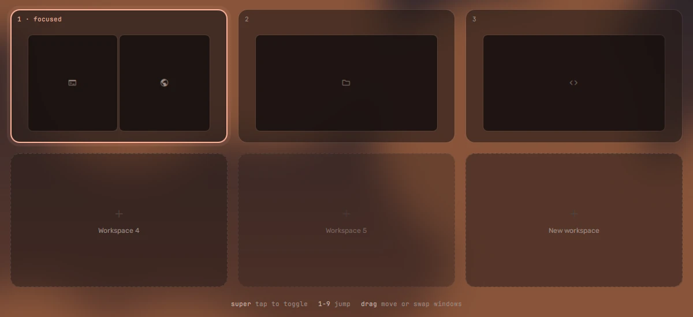
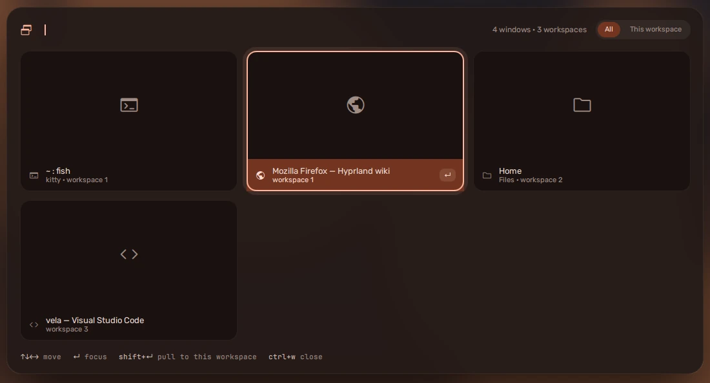

## The overview

**Tap super** (press and let go, nothing else) or **super + tab**. Every
workspace, as a card with its windows drawn in place, and a **New workspace**
card after them.

- **Click** a card to go there.
- **Drag a window** to another card to move it there -- onto *New workspace* to
  make one for it.
- Within a card, drop a tiled window on another to **swap** them, or a floating
  one where you want it.

## The window picker

**alt + tab** shows every window as a live thumbnail, most recent first, with
the selection on the window you were on before this one -- so a quick
alt + tab goes back, like it always has. Keep alt held and:

- **tab** / **shift + tab** or the arrows move;
- type to **filter** by name;
- **ctrl + W** closes the selected window without going to it;
- **shift + return** brings it here instead of travelling to it.

Let go of alt to switch.

## Moving windows

| Keys | Does |
| --- | --- |
| super + arrows | focus a window |
| super + shift + arrows | move it |
| super + 1..9 / super + shift + 1..9 | go to a workspace / send the window there |
| super + Q | close |
| super + F / super + shift + F | fullscreen / maximise |
| super + shift + V | float, or tile again |
| super + R | resize mode -- arrows or hjkl, escape to leave |
| super + S / super + shift + X | the scratchpad / send a window to it |

Everything else is on [Keybinds](../../configure/keybinds/).
